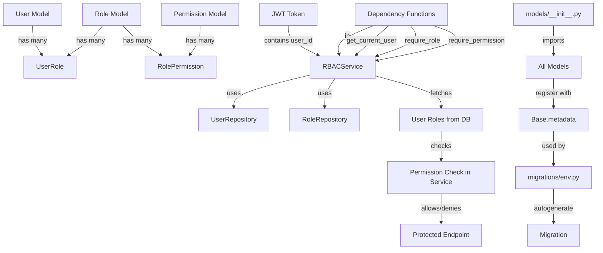

# Dynamic RBAC Implementation Plan

## Overview

Implement a flexible RBAC system where:

- **Roles** contain multiple **Permissions**
- **Users** can have multiple **Roles**
- Authorization checks fetch from database on each request for real-time accuracy
- JWT tokens include `user_id` for efficient database lookups
- Reusable FastAPI dependencies integrated into services/repositories

## Architecture



## Implementation Steps

### 1. Database Models (`models/`)

**Create `models/role.py`**:

- `Role` model with `name` (unique), `description`, `is_active`
- Fields: `id`, `name`, `description`, `is_active`, `created_at`, `updated_at`
- Inherits from `Base`

**Create `models/permission.py`**:

- `Permission` model with `name` (unique), `resource`, `action`, `description`
- Fields: `id`, `name`, `resource`, `action`, `description`, `created_at`, `updated_at`
- Example: `name="read_users"`, `resource="users"`, `action="read"`
- Inherits from `Base`

**Update `models/user.py`**:

- Add relationship: `roles: Mapped[list[Role]] = relationship(secondary="user_roles", ...)`
- Add method: `get_all_permissions()` to aggregate permissions from all roles

**Create `models/rbac.py`**:

- `UserRole` association table (user_id, role_id) using `Table`
- `RolePermission` association table (role_id, permission_id) using `Table`
- Both tables reference `Base.metadata`

### 2. Update Models Package (`models/__init__.py`)

**Update `models/__init__.py`**:

- Import all new RBAC models so they register with `Base.metadata`:
  ```python
  from models.base import Base
  from models.social_providers import SocialProvider
  from models.user import User
  from models.role import Role
  from models.permission import Permission
  from models.rbac import UserRole, RolePermission
  
  __all__ = [
      "Base",
      "SocialProvider",
      "User",
      "Role",
      "Permission",
      "UserRole",
      "RolePermission",
  ]
  ```

- This ensures all models are registered with `Base.metadata` when the package is imported
- `migrations/env.py` already uses `Base.metadata` directly, so no changes needed there

### 3. Database Migration (`migrations/`)

**Generate migration using Alembic autogenerate**:

- Run: `alembic revision --autogenerate -m "add_rbac_tables"`
- Alembic will automatically detect changes in `Base.metadata`:
    - New `auth_roles` table (from Role model)
    - New `auth_permissions` table (from Permission model)
    - New `user_roles` association table (from UserRole)
    - New `role_permissions` association table (from RolePermission)
    - Relationships and foreign keys
    - Indexes and unique constraints
- Review the generated migration file and adjust if needed (e.g., add custom indexes)

### 4. JWT Token Enhancement (`utils/jwt.py`)

**Update `generate_jwt_token()`**:

- Add `user_id` to payload: `"user_id": user.id`
- Keep existing claims (iss, sub, aud, exp)

**Update `verify_jwt_token()`**:

- Return user_id from payload: `payload.get("user_id")`
- Return full payload or create a token payload schema

**Create `get_user_id_from_token()` helper**:

- Extract and return user_id from token payload
- Used by dependency functions

### 5. Repositories (`repositories/`)

**Create `repositories/role_repository.py`**:

- `get_role_by_name(name: str) -> Role | None`
- `get_all_roles() -> list[Role]`
- `create_role(role_data) -> Role`
- `assign_role_to_user(user_id: int, role_id: int)`
- `remove_role_from_user(user_id: int, role_id: int)`

**Create `repositories/permission_repository.py`**:

- `get_permission_by_name(name: str) -> Permission | None`
- `get_all_permissions() -> list[Permission]`
- `create_permission(permission_data) -> Permission`
- `assign_permission_to_role(role_id: int, permission_id: int)`
- `remove_permission_from_role(role_id: int, permission_id: int)`

**Update `repositories/user_repository.py`**:

- `get_user_by_id(user_id: int) -> User | None`
- `get_user_roles(user_id: int) -> list[Role]` (with eager loading)
- `get_user_permissions(user_id: int) -> list[Permission]` (aggregate from all roles)

### 6. RBAC Service (`services/`)

**Create `services/rbac_service.py`**:

- `RBACService` class with methods:
        - `check_user_role(user_id: int, role_name: str) -> bool`
        - `check_user_permission(user_id: int, permission_name: str) -> bool`
        - `get_user_roles(user_id: int) -> list[Role]`
        - `get_user_permissions(user_id: int) -> list[Permission]`

- **FastAPI Dependency Functions** (module-level functions that use RBACService):
        - `get_current_user(token: str, db: AsyncSession) -> User`
                - Extract user_id from token using `utils.jwt.get_user_id_from_token()`
                - Fetch user from database using UserRepository
                - Return User object
                - Raises HTTPException(401) if token invalid or user not found

        - `require_role(role_name: str)` dependency factory
                - Returns a FastAPI dependency function
                - Uses RBACService to check if current user has the specified role
                - Raises HTTPException(403) if not

        - `require_permission(permission_name: str)` dependency factory
                - Returns a FastAPI dependency function
                - Uses RBACService to check if current user has the specified permission (via any role)
                - Raises HTTPException(403) if not

        - `require_any_role(role_names: list[str])` dependency factory
                - Returns a FastAPI dependency function
                - Checks if user has at least one of the specified roles

        - `require_any_permission(permission_names: list[str])` dependency factory
                - Returns a FastAPI dependency function
                - Checks if user has at least one of the specified permissions

**Update `services/__init__.py`**:

- Export dependency functions: `get_current_user`, `require_role`, `require_permission`, etc.

### 7. Schemas (`schemas/`)

**Create `schemas/role.py`**:

- `RoleCreateSchema`, `RoleResponseSchema`, `RoleUpdateSchema`
- `PermissionCreateSchema`, `PermissionResponseSchema`
- `UserRoleAssignSchema`, `RolePermissionAssignSchema`

### 8. Token Payload Schema (`schemas/user.py`)

**Update `schemas/user.py`**:

- Create `TokenPayloadSchema` with `user_id`, `email`, `exp`, etc.
- Update `verify_jwt_token()` to return this schema (optional)

### 9. Example Usage in Endpoints

**Example endpoint protection**:

```python
from services.rbac_service import get_current_user, require_permission

@router.get("/admin/users")
async def list_users(
    current_user: User = Depends(require_permission("read_users")),
    db: AsyncSession = Depends(get_session)
):
    # User has "read_users" permission
    ...
```

## Key Files to Modify/Create

**New Files**:

- `models/role.py` - Role model
- `models/permission.py` - Permission model  
- `models/rbac.py` - Association tables
- `repositories/role_repository.py` - Role CRUD operations
- `repositories/permission_repository.py` - Permission CRUD operations
- `services/rbac_service.py` - RBAC business logic and FastAPI dependencies
- `schemas/role.py` - Role/Permission schemas
- `migrations/versions/XXXXX_add_rbac_tables.py` - Database migration (auto-generated)

**Modified Files**:

- `models/user.py` - Add roles relationship
- `models/__init__.py` - Import all new RBAC models to register with Base.metadata
- `utils/jwt.py` - Add user_id to token payload, add `get_user_id_from_token()` helper
- `repositories/user_repository.py` - Add role/permission queries
- `repositories/__init__.py` - Export new repositories
- `services/__init__.py` - Export RBAC dependency functions
- `schemas/user.py` - Add TokenPayloadSchema (optional)

## Database Schema

```
auth_users (existing)
  - id (PK)
  - email
  - ...

auth_roles (new)
  - id (PK)
  - name (unique)
  - description
  - is_active
  - created_at, updated_at

auth_permissions (new)
  - id (PK)
  - name (unique)
  - resource
  - action
  - description
  - created_at, updated_at

user_roles (new - association)
  - user_id (FK -> auth_users.id)
  - role_id (FK -> auth_roles.id)
  - Primary key: (user_id, role_id)

role_permissions (new - association)
  - role_id (FK -> auth_roles.id)
  - permission_id (FK -> auth_permissions.id)
  - Primary key: (role_id, permission_id)
```

## Benefits

1. **Dynamic**: Roles and permissions can be managed without code changes
2. **Flexible**: Users can have multiple roles, roles can have multiple permissions
3. **Real-time**: Authorization checks always reflect current database state
4. **Reusable**: Dependencies can be easily applied to any endpoint
5. **Scalable**: Efficient queries with proper indexing
6. **Type-safe**: Full SQLAlchemy relationships and Pydantic schemas
7. **Clean Architecture**: Dependencies integrated with services/repositories, not separate files
8. **Auto-generated Migrations**: Alembic detects changes via Base.metadata automatically